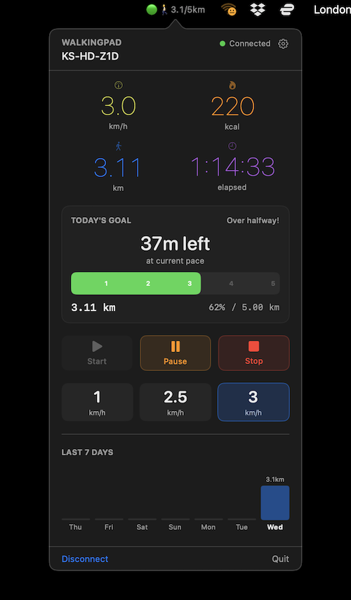

# WalkingPad

A lightweight macOS menu bar app for controlling WalkingPad and KingSmith treadmills over Bluetooth (BLE). No app store, no account, no cloud — just a simple native app that talks directly to your treadmill.


<!-- TODO: Add screenshot -->

## Features

- **Menu bar app** — lives in your menu bar, doesn't clutter your dock
- **BLE/FTMS control** — start, stop, pause, and set speed directly from your Mac
- **Daily goal tracking** — configurable distance goal with progress bar and time-remaining estimate
- **Accurate calorie calculation** — uses ACSM metabolic equations with your personal stats (weight, height, age, gender), not the treadmill's built-in calorie count
- **7-day history** — bar chart showing your daily distance with streak tracking
- **Celebration** — fun animation when you hit your daily goal
- **Persistent data** — stats survive app restarts (stored in `~/.walkingpad/data.json`)
- **First-run setup** — prompts for your profile on first launch
- **Configurable** — daily goal, default start speed, and body metrics via settings (gear icon)

## Requirements

- macOS 13.0 (Ventura) or later
- Apple Silicon (arm64) Mac
- A Bluetooth-enabled treadmill that supports **FTMS** (Fitness Machine Service)

## Compatible Treadmills

The app communicates using the **Bluetooth FTMS standard** (UUID `0x1826`), so it should work with any treadmill that advertises this service. Tested with:

- **KingSmith / WalkingPad** (Z1D, and likely other models — P1, C1, C2, A1 Pro, R1 Pro, R2, X21, etc.)

If your treadmill supports FTMS, it should work. KingSmith vendor-specific features (step count via `FFC0`/`FFF0` services) are supported as a bonus but not required.

If you've tested with a different model, please open an issue or PR to add it to the list.

## Install

### Prerequisites

- **Xcode Command Line Tools** (for `swiftc`):
  ```bash
  xcode-select --install
  ```

### Build & Run

```bash
git clone https://github.com/drpancake/macos-walkingpad.git
cd macos-walkingpad/WalkingPad
./build.sh
open build/WalkingPad.app
```

On first launch, macOS will ask for Bluetooth permission — grant it so the app can communicate with your treadmill.

The app will appear as a 🚶 icon in your menu bar. Click it to open the control panel.

### Keeping it running

To have WalkingPad start automatically on login:

1. Open **System Settings > General > Login Items**
2. Click **+** and select `WalkingPad/build/WalkingPad.app`

Or move/copy the built `.app` to `/Applications` first.

## Configuration

On first launch, you'll be prompted to set up your profile:

| Setting | Default | Description |
|---------|---------|-------------|
| Weight | 70 kg | Used for calorie calculation |
| Height | 170 cm | Used for calorie calculation |
| Age | 30 | Used for calorie calculation |
| Gender | Male | Used for calorie calculation |
| Daily goal | 5.0 km | Your target distance per day |
| Start speed | 2.5 km/h | Speed when you press Start |

You can change these any time via the gear icon in the top-right corner of the popup.

Data is stored in `~/.walkingpad/data.json`.

## How Calories Are Calculated

The app ignores the treadmill's built-in calorie number and instead uses the **ACSM metabolic equations** with your personal resting metabolic rate (Mifflin-St Jeor):

1. **BMR** from your weight, height, age, and gender
2. **Resting VO2** derived from your personal BMR (not the standard 3.5 ml/kg/min)
3. **Exercise VO2** based on actual speed: `0.1 × speed(m/min)` for walking, `0.2 × speed(m/min)` for running (>6 km/h)
4. **kcal/min** accumulated in real-time from BLE speed data

## Python Scripts

Included utility scripts for debugging and CLI control (require [bleak](https://github.com/hbldh/bleak)):

```bash
pip install bleak
```

| Script | Description |
|--------|-------------|
| `walkingpad.py` | CLI controller — scan, start, stop, set speed, get status |
| `walkingpad_discover.py` | List BLE services and characteristics |
| `probe_ble.py` | Deep probe of all readable/notifiable characteristics |

```bash
# Find your treadmill
python walkingpad.py scan

# Get status
python walkingpad.py status <address>

# Start at 2.5 km/h
python walkingpad.py start <address> 2.5
```

## License

MIT
